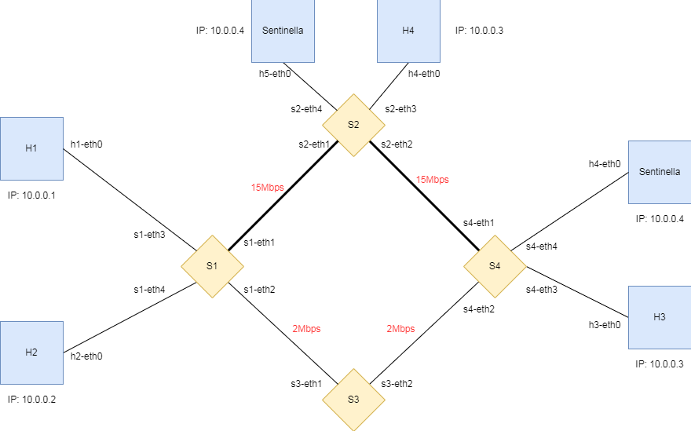

# Network slicing optimization demo
## Introduction
This demo aims to model a scenario where a service deployed on a network is kept running at optimized working conditions through SDN and NFV, dynamically changing the slicing setup and migrating the server location based on real time performance analysis.

## Topology


The network's topology is fairly simple. Host h2 acts as a client using a generic service, which in our case is simply a counter incrementing on a server, which is deployed to either h3 or h4, which share the same IP address for this reason. In this demo's case, the service starts on h3.

The host h1 is then added to act as a monitor, using `iperf` to gather information on the network's links performance and sending it back to the controller at a set time interval (10s). This is done by a host in the network and not by the controller itself because it is external to the network and can't run commands on the network itself, so it has to rely on a helper monitor.

Two extra dummy ("Sentinella") hosts h5 and h6 are then added. This is because the monitor can't always check the performance of specific links without them. For example to check the performance of s1-s2 if the service is deployed on h3 the monitor can not simply run `iperf` towards h4, since it has the same IP of h3 and, since the service is currently running on h3, any packets for `10.0.0.3` will be routed to h3. 
Therefore, when the service is on h3 the dummy on s2 will be active and viceversa.

Finally, the slicing setup for this network includes two slices, a "high performance" slice, which in the beginning of the demo routes packets on the high performing links s1-s2 and s2-s4, used by our service and a "low performance" slice, which in the beginning routes packets on the low performing links s1-s3 and s3-s4, for everything else.

## Running the demo
To run this demo, we recommend opening two separate terminal windows: one for the controller and one for the rest of the network.

Before running, make sure to run ```./build.sh``` to build the docker images for the network and make sure mininet is cleared. Remember to make it executable with ```chmod +x ./build.sh``` before running it.

Start the network controller first on one terminal window using:
```
ryu-manager controller.py
```
and then run the network with:
```
sudo python3 definitivo.py
```

After initialization, you will be presented with a menu with options to interact with the network, dynamically changing the bandwith of any link, or to check the logs on any host (except the dummies) in the network. Some sample scenarios will now be presented and discussed:

## Scenarios
If not otherwise specified, assume any scenario starts from the initial conditions described in [Topology](#Topology).

- If link s1-s2's bandwidth changes to 1Mbps, using the upper slice for high performance is no longer favorable, thus the controller will swap the two slices, making the lower slice the high performance one, but keeping the server on h3 (moving to h4 would make no difference, since the bottleneck is shared)
  
- If link s2-s4's bandwidth changes to 1Mbps, keeping the server on h3 is no longer favorable, since it can be moved to h4 and keep the same high performance, since link s1-s2 is still good. Thus, the controller migrates the service to h4, keeping the internal status.

- If the server is currently deployed on h4, meaning the upper slice is used for high performance, and link s1-s2's bandwidth changes to 1Mbps, it's now optimal to both swap slices and migrate the server to h3 to ensure optimal performance for the service. The controller thus performs both actions and returns the network to the demo's initial state.

Note that these scenarios don't include every possible condition that can be verified in the network, but rather every action the controller can take (besides obviously doing nothing if the network is already in an optimal state). Every condition should still be able to be optimized with these three different actions.

This is obviously an ideal demo tailor made for our specific topology. In a more practical environment a controller would theoretically be able to perform these three actions (`SWAP`, `MIGRATE` and `MIGRATE-SWAP`) and would need to be configured manually using them for any given topology.

The solution used in this demo using dummy hosts admittedly isn't particularly elegant and doesn't translate well to a real use case. It would be best to use a monitor to track the links' performance from the switches, which can interact with the controller directly, so no additional hosts would be required. This was the first approach we tried but we weren't able to make it work due to incompatible protocol versions between the controller and the switches, so we opted for this solution which is guaranteed to work anywhere (since it just involves running scripts on the hosts themselves). This is a tradeoff that's worth remembering when thinking to more practical approaches.

The monitor script could also run in the client host to avoid adding additional hardware, but we opted to keep them separate since it didn't really make sense to have a client run foreign scripts to help the network perform, so we think it is a fair tradeoff. They could still very easily be merged into one if necessary.
